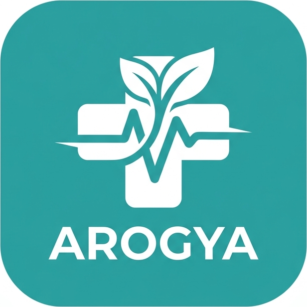
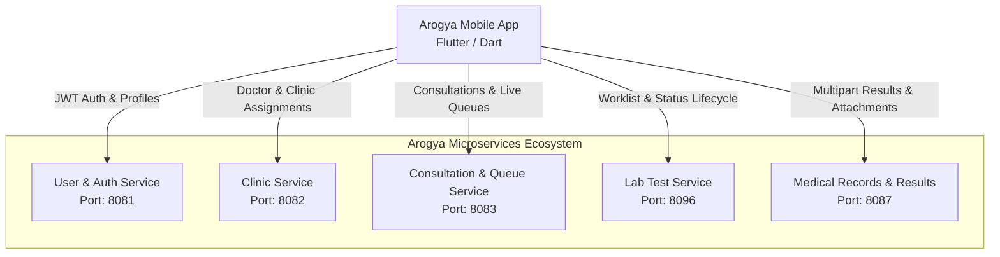

<div align="center">

  

  # Arogya Mobile Application
  ### Comprehensive Smart Healthcare & Clinical Management Mobile Suite

  [](https://flutter.dev)
  [](https://dart.dev)
  [](https://developer.android.com)
  [](https://spring.io/projects/spring-boot)
  [](LICENSE)

  <p align="center">
    Arogya is an enterprise-grade digital healthcare platform designed to streamline clinical workflows, patient queues, medical consultations, and laboratory operations between patients, doctors, technicians, and healthcare administrators.
  </p>
</div>

---

## 📑 Table of Contents
- [Overview](#-overview)
- [Role-Based Portals & Key Features](#-role-based-portals--key-features)
  - [Doctor Portal](#-doctor-portal)
  - [Technician Portal](#-technician-portal)
  - [Patient Portal](#-patient-portal)
  - [Admin Shell](#-admin-shell)
- [Architecture & Microservices Mapping](#-architecture--microservices-mapping)
- [Technology Stack](#-technology-stack)
- [Project Directory Structure](#-project-directory-structure)
- [Getting Started](#-getting-started)
  - [Prerequisites](#prerequisites)
  - [Installation & Setup](#installation--setup)
  - [Configuring Backend Endpoints](#configuring-backend-endpoints)
  - [Running the Application](#running-the-application)
- [Building the Application](#-building-the-application)
- [Security & Authentication](#-security--authentication)
- [Author & Acknowledgments](#-author--acknowledgments)

---

## 🩺 Overview

The **Arogya Mobile Application** connects patients, clinicians, and medical laboratory staff to a distributed microservice backend. It provides real-time patient queue management, live consultation notes and diagnoses, clinic scheduling, laboratory test worklists, and secure test report dissemination.

Built with Flutter and adhering to modern Material 3 design principles, the application provides an intuitive, high-performance experience with offline resilience and secure role-based access control.

---

## 👥 Role-Based Portals & Key Features

### 🩺 Doctor Portal
- **Assigned Clinics View**: Displays clinics specifically assigned to the logged-in doctor, with scheduled sessions, location details, and active consultation queues.
- **Real-Time Patient Queue**: View waiting patients, call next patient, and view queue progress in real-time.
- **Consultation Management**:
  - Record patient symptoms, diagnoses, and clinical observations.
  - Prescribe medicines with dosage, frequency, and instructions.
  - Order laboratory diagnostic tests directly within the consultation workflow.
- **Historical Patient Records**: Access previous consultations, medical records, and completed laboratory findings.

### 🔬 Technician Portal
- **Laboratory Worklist**:
  - Filter lab tests by lifecycle status: `ALL`, `PENDING`, `IN_PROGRESS`, `COMPLETED`, `CANCELLED`.
  - Search tests by patient name, consultation ID, or test identifier.
  - Quick action status management: transition tests directly from `PENDING` &rarr; `IN_PROGRESS` &rarr; `COMPLETED`.
- **Submit Test Result**:
  - Contextual test details banner displaying patient and consultation metadata.
  - **Status Selection**: Option to finalize the test as `Completed` or save findings while keeping the test `In Progress` for ongoing observation.
  - Detailed findings description and optional technician notes.
  - **Multi-File Uploads**: Attach up to 5 diagnostic files (`PDF`, `DOC`, `DOCX`, `JPG`, `PNG`) with a 10MB limit per file.
- **Edit Test Result**:
  - Full modification support for existing findings and notes.
  - File management: remove existing files and upload replacement files up to the 5-file ceiling.
  - Ability to transition statuses between `Completed` and `In Progress`.
- **Result Details & Inspection**:
  - Display recorded findings and technician comments.
  - Interactive file list with download functionality and built-in pinch-to-zoom image viewer for scan/report files.
  - Safe deletion workflow that reverts test status back to `In Progress`.

### 👤 Patient Portal
- **Consultation History**: View completed consultation records, prescribed medications, doctor notes, and diagnostic orders.
- **Queue Tracking**: Live queue status indicator showing current token number and estimated wait time.
- **Lab Test Results**: Review diagnostic findings and view attached test result reports.
- **Clinic Discovery**: Explore Arogya mobile clinic locations and doctor availability.

### ⚙️ Admin Shell
- Clinic oversight, doctor assignment inspection, technician coordination, and healthcare service monitoring.

---

## 🏛 Architecture & Microservices Mapping

The mobile application communicates with the Arogya Spring Boot backend ecosystem:



### Microservice Endpoints Reference

| Service | Port | Base Path | Core Responsibilities |
|---|---|---|---|
| **User Service** | `8081` | `/users`, `/auth` | Authentication, JWT token verification, role resolution, profiles |
| **Clinic Service** | `8082` | `/clinics`, `/clinic-doctors` | Clinic rosters, schedules, doctor clinic assignments |
| **Consultation Service** | `8083` | `/consultations`, `/queue` | Patient queues, clinical notes, prescriptions |
| **Lab Test Service** | `8096` | `/lab-tests` | Diagnostic orders, test status lifecycle (`start`, `complete`) |
| **Medical Records Service** | `8087` | `/test-results` | Multipart file uploads, reports, test result storage & downloads |

---

## 🛠 Technology Stack

- **Framework**: [Flutter](https://flutter.dev) (v3.10+ / Dart 3.x)
- **UI Framework**: Material Design 3 with custom healthcare teal palette (`#0891B2`, `#0E7490`, `#38A3A5`)
- **State Management**: [Provider](https://pub.dev/packages/provider)
- **Networking**: [http](https://pub.dev/packages/http) & [http_parser](https://pub.dev/packages/http_parser) (REST API & Multipart Form Data)
- **Persistent Storage**: [shared_preferences](https://pub.dev/packages/shared_preferences)
- **File & Media Handling**: [file_picker](https://pub.dev/packages/file_picker) for documents and images
- **Icons**: [Cupertino Icons](https://pub.dev/packages/cupertino_icons) & Material Icons

---

## 📁 Project Directory Structure

```
Arogya-Mobile-Application/
├── README.md
└── arogya_moblie_app/
    ├── android/                     # Android native project configuration
    ├── assets/
    │   └── images/                  # Logos and illustration assets
    ├── lib/
    │   ├── main.dart                # Application entrypoint & route registration
    │   ├── app_theme.dart           # Global theme, typography, color palette
    │   ├── models/                  # Data models (User, Role, Consultation, etc.)
    │   ├── screens/
    │   │   ├── login_screen.dart             # Secure authentication & session screen
    │   │   ├── signup_screen.dart            # User registration screen
    │   │   ├── role_selection_screen.dart    # Role selection interface
    │   │   ├── dashboard_screen.dart         # Multi-role home dashboard & stats
    │   │   ├── clinics_screen.dart           # Clinic rosters & queue management
    │   │   ├── lab_tests_screen.dart         # Technician worklist, submit & edit modal sheets
    │   │   ├── profile_screen.dart           # User profile & credentials management
    │   │   └── admin_shell.dart              # Administrative oversight screen
    │   └── services/
    │       ├── api_auth.dart                 # Bearer tokens & role-based header interceptor
    │       ├── user_api_service.dart         # User & profile API integration
    │       ├── clinic_api_service.dart       # Clinic & doctor assignment API integration
    │       ├── consultation_api_service.dart # Consultation & queue API integration
    │       ├── lab_test_api_service.dart     # Lab test order & lifecycle management
    │       └── test_results_api_service.dart # Multipart test result CRUD & file storage
    └── pubspec.yaml                 # Dependencies and asset declarations
```

---

## 🚀 Getting Started

### Prerequisites

Ensure the following tools are installed on your workstation:
- [Flutter SDK](https://docs.flutter.dev/get-started/install) (`>= 3.10.7`)
- [Dart SDK](https://dart.dev/get-dart) (`>= 3.0.0`)
- [Android Studio](https://developer.android.com/studio) with Android SDK and an active Android Virtual Device (AVD) or physical device
- [Java Development Kit (JDK 17)](https://www.oracle.com/java/technologies/downloads/#java17)

### Installation & Setup

1. **Clone the repository**:
   ```bash
   git clone https://github.com/Pathum-Vimukthi-Kumara/Arogya-Mobile-Application.git
   cd Arogya-Mobile-Application/arogya_moblie_app
   ```

2. **Install project dependencies**:
   ```bash
   flutter pub get
   ```

### Configuring Backend Endpoints

By default, the application connects to local microservices via Android Emulator loopback addresses (`10.0.2.2`).

If running on a **physical device**, update the IP address to your machine's local LAN IP in the service configuration files (`lib/services/*_api_service.dart`):

| Service File | Variable | Default Emulator URL | Physical Device Example |
|---|---|---|---|
| `user_api_service.dart` | `_baseUrl` | `http://10.0.2.2:8081` | `http://192.168.1.100:8081` |
| `clinic_api_service.dart` | `_baseUrl` | `http://10.0.2.2:8082` | `http://192.168.1.100:8082` |
| `consultation_api_service.dart` | `_baseUrl` | `http://10.0.2.2:8083` | `http://192.168.1.100:8083` |
| `test_results_api_service.dart` | `_baseUrl` | `http://10.0.2.2:8087` | `http://192.168.1.100:8087` |
| `lab_test_api_service.dart` | `_baseUrl` | `http://10.0.2.2:8096` | `http://192.168.1.100:8096` |

### Running the Application

Launch on a connected device or running emulator:
```bash
flutter run
```

---

## 📦 Building the Application

### Debug APK
```bash
flutter build apk --debug
```
*Output location: `build/app/outputs/flutter-apk/app-debug.apk`*

### Release APK
```bash
flutter build apk --release
```
*Output location: `build/app/outputs/flutter-apk/app-release.apk`*

---

## 🔒 Security & Authentication

The mobile client integrates with the Arogya backend security standard:
- **JWT Bearer Authentication**: Stores authentication tokens securely using `SharedPreferences`.
- **Identity Headers**: Automatically forwards `X-User-Email` and `X-User-Role` headers on authorized requests via `ApiAuth.headers()`.
- **Multipart Data Handling**: Streams uploads safely without corrupting JSON headers.
- **Client-Side File Validation**: Checks file extensions and enforces size constraints (< 10MB per file) before dispatching to the network.

---

## 👨‍💻 Author & Acknowledgments
- Developed as part of the **Arogya Healthcare Ecosystem**.
